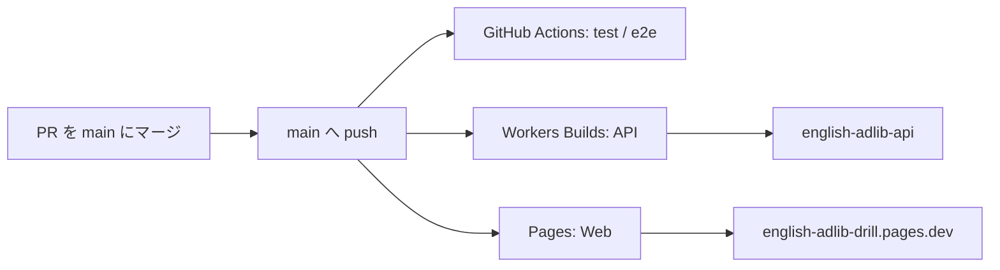

# デプロイ手順（Cloudflare）

## 方針

**GitHub の `main` ブランチへの push（PR マージ含む）をトリガーに、Cloudflare 側で自動ビルド・デプロイする。**

| 対象 | Cloudflare 機能 | トリガー |
|------|-----------------|----------|
| Web（フロント） | **Pages**（Git 連携） | `main` への push |
| API（Worker） | **Workers Builds**（Git 連携） | `main` への push |
| 品質チェック | **GitHub Actions**（CI のみ） | push / PR |

デプロイは GitHub Actions では行わない。`.github/workflows/ci.yml` はテスト（unit / e2e）のみ実行する。

## 前提

- Cloudflare アカウント
- GitHub リポジトリへの Admin 権限（Cloudflare GitHub App のインストール用）
- **Node.js 24 LTS**（基準 v24.15.0、`winget install OpenJS.NodeJS.LTS`。Wrangler 4）
- Workers AI が有効なアカウントであること

---

## 初回セットアップ（1 回だけ）

### 1. Cloudflare GitHub App をインストール

1. [Cloudflare Dashboard](https://dash.cloudflare.com/) → **Workers & Pages**
2. **Create** → **Pages** → **Connect to Git**（Workers でも同じ App を使う）
3. **Add account** → GitHub で **Cloudflare Workers and Pages** をインストール
4. 対象リポジトリ（`ENGLISH_AD-LIB_DRILL`）へのアクセスを許可

### 2. API（Worker）を初回作成し Secret を設定

Workers Builds を接続する前に、Worker 本体と Secret を用意する。

```bash
cd apps/api
pnpm install   # リポジトリルートから pnpm install --frozen-lockfile でも可
pnpm run deploy
```

- `wrangler.toml` の `SCORING_MODEL` を必要に応じて変更
- **Gemini フォールバック（任意・[ADR-0008](./adr/0008-gemini-ai-fallback.md)）**  
  Workers AI 失敗時に Gemini Developer API **無料枠**へ切り替える。Google AI Studio で **請求（Billing）を有効にしない**運用を推奨。

```bash
cd apps/api
pnpm exec wrangler secret put GEMINI_API_KEY
# AI Studio で発行した API キー（クライアントに露出しない）

# wrangler.toml または Dashboard の Variables:
# GEMINI_FALLBACK_ENABLED = "true"
# GEMINI_MODEL = "gemini-2.5-flash-lite"  （デフォルト済み）
```

- 無料枠では学習者のテキスト・音声が Google のプロダクト改善に利用される場合があります（[利用規約](https://ai.google.dev/gemini-api/terms?hl=ja)）。公開規模が大きくなったら有料ティアを検討してください。
- ローカル開発: `apps/api/.dev.vars` に `GEMINI_API_KEY` と `GEMINI_FALLBACK_ENABLED=true` を設定（gitignore 済み）

- 本番 CORS 用 Secret（Pages の URL が決まってから設定してもよい）:

```bash
cd apps/api
pnpm exec wrangler secret put ALLOWED_ORIGIN
# 例: https://english-adlib-drill.pages.dev
```

デプロイ後、Worker URL（例 `https://english-adlib-api.<account>.workers.dev`）を控える。

### 3. API — Workers Builds で Git 連携

1. Dashboard → **Workers & Pages** → Worker **`english-adlib-api`** を選択
2. **Settings** → **Builds** → **Connect**
3. 以下を設定:

| 項目 | 値 |
|------|-----|
| Git repository | 本リポジトリ |
| Production branch | `main` |
| Root directory | `/`（リポジトリルート） |
| Build command | `pnpm install --frozen-lockfile && pnpm --filter @english-adlib/api build` |
| Deploy command | `pnpm --filter @english-adlib/api exec wrangler deploy` |

4. **Save** 後、`main` へ push してビルドが走ることを確認

**モノレポのビルド監視（任意）**  
Settings → Builds → **Build watch paths** で、API 変更時だけビルドするよう絞り込める。

- Include: `apps/api/**`, `packages/**`
- Exclude: `apps/web/**`, `docs/**`, `e2e/**`

### 4. Web — Pages で Git 連携

1. Dashboard → **Workers & Pages** → **Create** → **Pages** → **Connect to Git**
2. 同じ GitHub リポジトリを選択
3. プロジェクト名例: **`english-adlib-drill`**
4. ビルド設定:

| 項目 | 値 |
|------|-----|
| Production branch | `main` |
| Root directory | `/`（リポジトリルート） |
| Build command | `pnpm install --frozen-lockfile && pnpm --filter @english-adlib/web build` |
| Build output directory | `apps/web/dist` |

5. **Environment variables**（Production）:

| 変数 | 値 |
|------|-----|
| `VITE_API_BASE_URL` | 手順 2 で控えた Worker URL（末尾スラッシュなし） |

6. **Save and Deploy**

**モノレポのビルド監視（任意）**

- Include: `apps/web/**`, `packages/**`
- Exclude: `apps/api/**`, `docs/**`, `e2e/**`

### 5. CORS Secret を相互に合わせる

Pages の本番 URL が確定したら、Worker 側の `ALLOWED_ORIGIN` を更新する。

```bash
cd apps/api
pnpm exec wrangler secret put ALLOWED_ORIGIN
# 例: https://english-adlib-drill.pages.dev
```

---

## 日常のデプロイフロー



1. feature ブランチで開発 → PR 作成
2. GitHub Actions でテストが通ることを確認
3. `main` にマージ
4. Cloudflare が自動的に API / Web をビルド・デプロイ
5. Dashboard → 各プロジェクトの **Deployments** で成功を確認

プレビュー環境（PR 用）が必要な場合は、Pages / Workers Builds の **Preview** 設定で `main` 以外のブランチビルドを有効にできる（Worker はデフォルトで `wrangler versions upload` となり、本番には昇格しない）。

---

## GitHub Actions（CI のみ）

`main` への push および PR で `.github/workflows/ci.yml` が実行される。

- **test**: unit テスト + Web ビルド確認
- **e2e**: Playwright E2E

**デプロイ用ジョブ（`deploy-api` / `deploy-web`）は使わない。** Cloudflare Git 連携に移行済みの場合は、ci.yml から削除してよい。

### CI 用 Secrets（デプロイ不要）

Cloudflare 自動デプロイでは GitHub Secrets に `CLOUDFLARE_API_TOKEN` 等は不要。CI のみなら追加 Secrets も不要。

---

## 手動デプロイ（緊急時・検証用）

Cloudflare 連携とは別に、ローカルから Wrangler でデプロイできる。

```bash
# API
cd apps/api
pnpm run deploy

# Web（ビルド後に wrangler pages deploy 等。通常は Pages Git 連携を使う）
pnpm --filter @english-adlib/web build
```

---

## ローカル開発

ターミナル1:

```bash
pnpm install
pnpm dev:api
```

ターミナル2:

```bash
pnpm dev:web
```

- Web: http://localhost:5173
- API: http://127.0.0.1:8787（Vite プロキシ経由で `/api`）

## Neuron 使用量

採点1回あたりおおよそ 15〜25 Neurons（モデル・回答長による）。無料枠 10,000 Neurons/日。詳細は [ADR-0004](./adr/0004-llm-and-scoring.md)。

## Gemini フォールバック（任意）

Workers AI が失敗したときのみ Gemini を 1 回呼び出す。フォールバックが多いと Gemini 無料枠の **RPD（1 日あたりリクエスト数）** が先に枯渇し得る。AI Studio の **Rate Limits** で実値を確認すること。Worker ログに `[ai-fallback]` が出たら Gemini 経由で処理された印。

## ローカル E2E

```bash
pnpm test:e2e
```

（Vite dev server を自動起動し、API は Playwright でモック）
